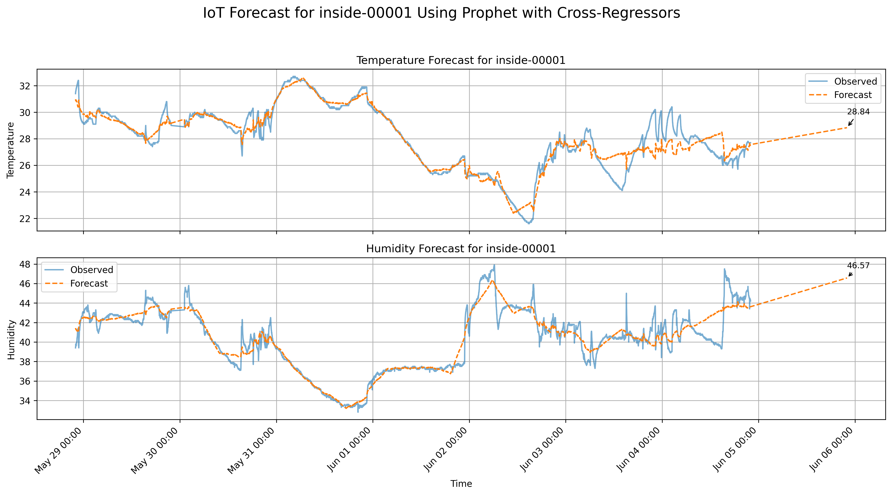

# Talk: IoT Data Pipeline with ESP32, AWS IoT, Redpanda, and Prophet

This repository contains the materials for a talk on building an IoT data pipeline using an ESP32 microcontroller, AWS IoT, Redpanda, and Meta's Prophet library for time series forecasting.

## Overview

The talk covers the following topics:

1.  **ESP32 with DHT11 Sensor to AWS IoT:**
    *   An ESP32 microcontroller equipped with a DHT11 temperature and humidity sensor sends data to AWS IoT Core using an MQTT library.
    *   See the `esp32/` directory for the ESP32 code.

2.  **Redpanda Connect:**
    *   Redpanda Connect picks up the MQTT messages from AWS IoT.
    *   These messages are then forwarded to a Redpanda topic in a Redpanda BYOC (Bring Your Own Cloud) cluster.
    *   See the `redpanda-connect/` directory for the Redpanda Connect configuration.

3.  **Redpanda Iceberg Topic:**
    *   The Redpanda topic is configured as an Iceberg table, allowing for efficient querying and analysis of the IoT data.

4.  **Querying Data:**
    *   Basic querying techniques for the Iceberg table are demonstrated.
    *   See the `regression/duckdb-select.py` file for an example of querying the data with DuckDB.

5.  **Linear Regression with Meta's Prophet:**
    *   The talk covers performing linear regression on the IoT data using Meta's Prophet library.
    *   An example of using Prophet for time series forecasting is provided.
    *   See the `regression/duckdb-prophet.py` file for the Prophet example.
    *   Here's a forecast chart generated by the Prophet script:
    *   

## Directory Structure

*   `esp32/`: Contains the source code for the ESP32 microcontroller.
*   `redpanda-connect/`: Contains the configuration for Redpanda Connect.
*   `regression/`: Contains the scripts for querying and performing linear regression on the data.
*   `schema/`: Contains the schema for the environment data values.
